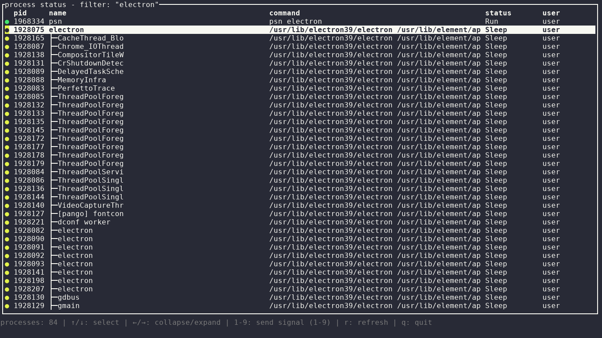

<!-- Copyright (c) 2026 l5yth -->
<!-- SPDX-License-Identifier: Apache-2.0 -->

# psn

[](https://github.com/l5yth/psn/actions/workflows/rust.yml)
[](https://codecov.io/gh/l5yth/psn)
[](https://github.com/l5yth/psn/releases)
[](https://crates.io/crates/psn)
[](https://aur.archlinux.org/packages/psn-bin)
[](https://github.com/l5yth/psn/blob/main/flake.nix)
[](https://github.com/l5yth/psn/tree/main/packaging/gentoo)
[](https://github.com/l5yth/psn)
[](https://github.com/l5yth/psn/blob/main/LICENSE)

`psn` is a Rust terminal UI for viewing process status and sending signals.



- [x] Browse running processes in a terminal UI
- [x] Filter processes by text match `<FILTER>` or regular expression `-r <PATTERN>`
- [x] Show only the current user's processes with `-u`
- [x] Send Unix signals `1` through `9` to the selected process

## Dependencies

- any GNU/Linux system with `ps` obviously
- `ps` available in `$PATH`
- Some current Rust stable toolchain (Rust 2024 edition, Cargo)

Core crates: `ratatui`, `crossterm`, `sysinfo`, `nix`, `anyhow`, `users`.

## Installation

Helpers exist for Arch and Gentoo-based systems but you can install also
via crates.io or from source directly.

### Archlinux

See [PKGBUILD](./packaging/archlinux/PKGBUILD)

### Gentoo

See [psn-9999.ebuild](./packaging/gentoo/app-misc/psn/psn-9999.ebuild)

### Cargo Crates

```bash
cargo install psn
```

### From Source

Build from source:

```bash
git clone https://github.com/l5yth/psn.git
cd psn
cargo build --release
```

Run the built binary:

```bash
./target/release/psn
```

Or run directly in development:

```bash
cargo run --release --
```

## Usage

```text
psn v0.1.1
process status navigator
apache v2 (c) 2026 l5yth

usage: psn <FILTER>
usage: psn [OPTIONS] -f <FILTER>
usage: psn [OPTIONS] -r <PATTERN>

Terminal UI for browsing process status and sending Unix signals.

Options:
  -h, --help            Show usage instructions
  -v, --version         Show version
  -f, --filter <value>  Filter process names/commands (case insensitive string)
  -r, --regex <value>   Use regex matching (regular expression pattern)
  -u, --user            Show only current user's processes
```

Examples:

```bash
# substring filter (positional)
psn "sshd"

# substring filter via option
psn -f "systemd"
psn --filter "python"

# regex filter
psn -r 'ssh(d|agent)'
psn --regex '(nginx|apache2)'

# current user only
psn -u
psn -u -f "cargo"
psn -u -r '^bash$'
```

In-app keys:

- `q`: quit
- `r`: refresh process list
- `↑` / `↓`: move selection in process list
- `1`..`9`: send corresponding kill signal to selected process

## Development

```bash
cargo check
cargo test --all --all-features --verbose
cargo fmt --all
cargo clippy --all-targets --all-features -- -D warnings
```
